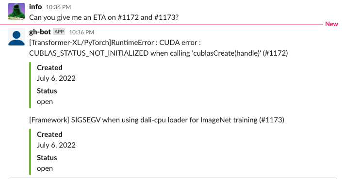

# GitHub Slack Bot with Go

A simple slack bot that will listen for and respond to any mention of github issues.



## Setup

Provide the following environment variables:

* REPO_OWNER (name of GitHub repo owner / org)
* REPO_NAME (name of GitHub repo)
* OAUTH_TOKEN (slack OAUTH bot token)
* APP_TOKEN (slack APP token)

Download [Go](https://go.dev/doc/install).
Run this followed commands:

```bash
# Install dependencies (only the first time)
go install

# Run the local server at localhost:8080
npm run main.go

# Build for production in the dist/ directory
npm build
```
